<div align="center">

# Carreau

**Des QCM sur téléphone, en classe, pour des examens équitables.**

Les étudiants rejoignent l’examen en scannant un QR code et répondent question par question sur leur téléphone. L’enseignant suit la session en direct.

[Fonctionnement](#fonctionnement) · [Anti-triche](#anti-triche--ce-que-carreau-détecte-et-ce-quil-ne-peut-pas-détecter) · [Données personnelles](#données-personnelles) · [Architecture](#architecture) · [Feuille de route](#feuille-de-route) · [Licence](#licence)


[](https://github.com/a8naaijetvi2lunk/carreau/actions/workflows/ci.yml)


</div>

> [!NOTE]
> Carreau est en cours de développement. Le socle technique est en place ; les fonctionnalités arrivent lot par lot (voir la [feuille de route](#feuille-de-route)). Les captures ci-dessous viennent de l’application réelle, avec des données fictives ; elles sont régénérées à chaque lot par `npm run captures`.

## Pourquoi Carreau

Faire passer un QCM sur le téléphone des étudiants est pratique : pas de papier, correction immédiate, résultats exportables. Mais sur un téléphone, une autre application ou un autre onglet n’est jamais loin.

Un navigateur ne peut pas verrouiller un téléphone. Carreau ne prétend donc pas empêcher toute triche. Il rend les écarts **visibles**, de façon **transparente** pour les étudiants, et laisse l’enseignant juger avec ce qu’il observe en salle.

Le nom tient en un mot : les petits carrés du QR code, les cases qu’on coche, et l’expression « se tenir à carreau ».

## Aperçu

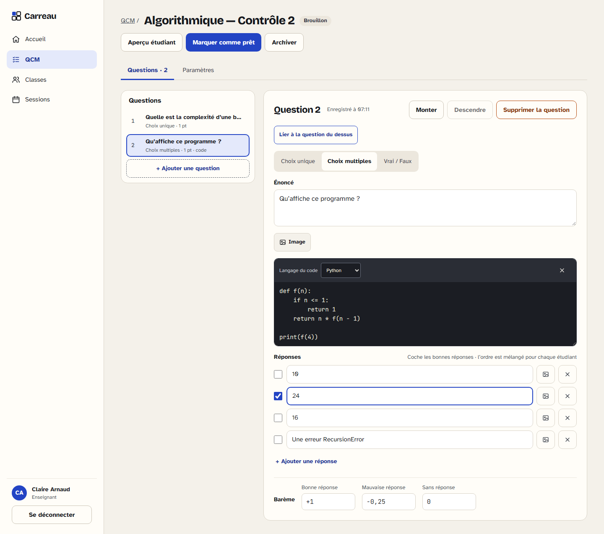
*L’éditeur de QCM : question à choix multiples avec un bloc de code Python, enregistrée au fil de la saisie.*

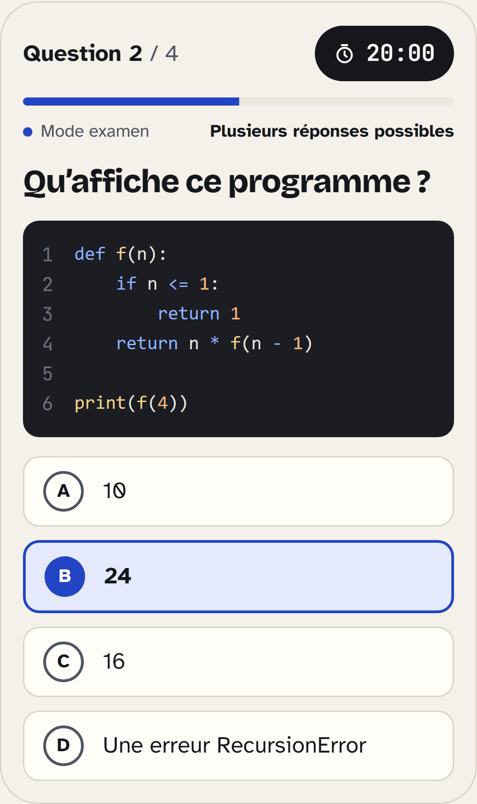

*L’aperçu étudiant sur téléphone : le code est coloré côté serveur, la bonne réponse n’est jamais envoyée au navigateur.*

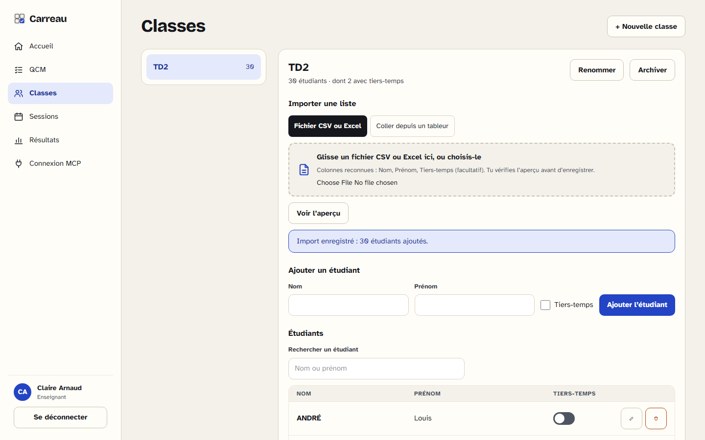
*Une classe importée depuis un fichier CSV d’Excel, tiers-temps compris.*

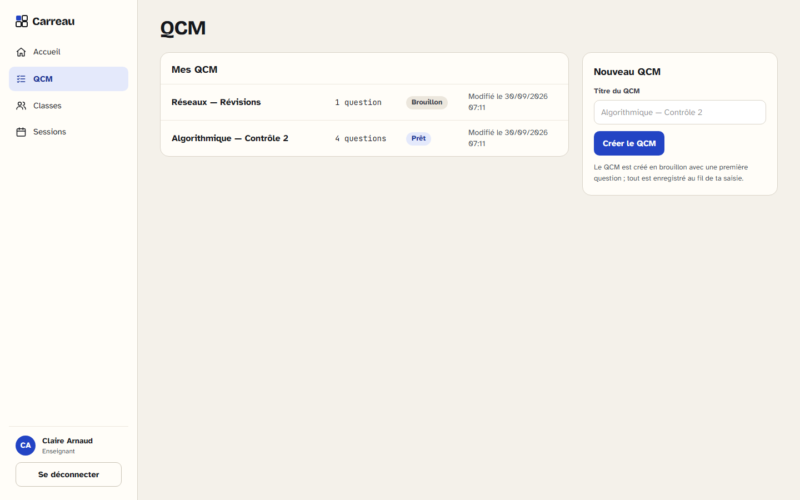
*Les QCM de l’enseignant et leur statut.*

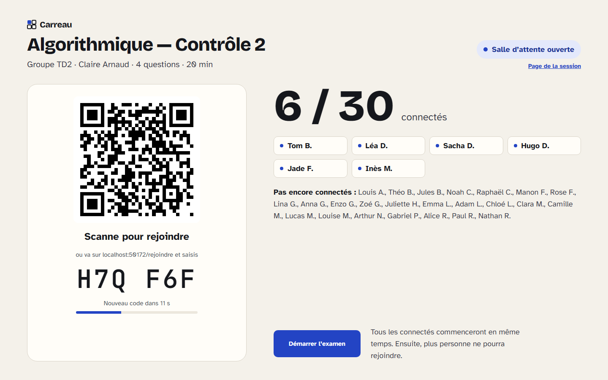
*L’écran projeté : le QR code et le code changent toutes les 30 secondes ; la salle se remplit en direct.*

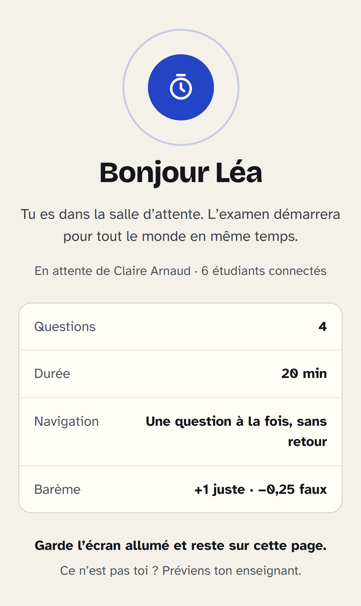

*La salle d’attente sur le téléphone d’une étudiante : l’examen démarre pour tout le monde au même instant.*

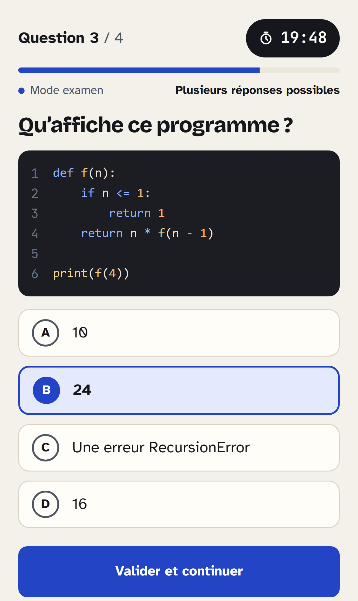

*Pendant l’examen : une question à la fois, le code coloré côté serveur, un chrono tenu par le serveur. Chaque touche est enregistrée.*

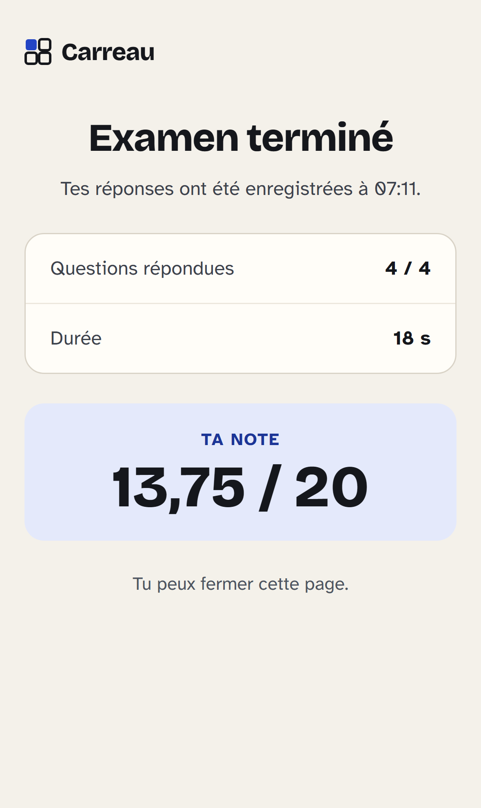

*La fin de l’examen : réponses enregistrées, durée, et la note si l’enseignant la rend visible.*

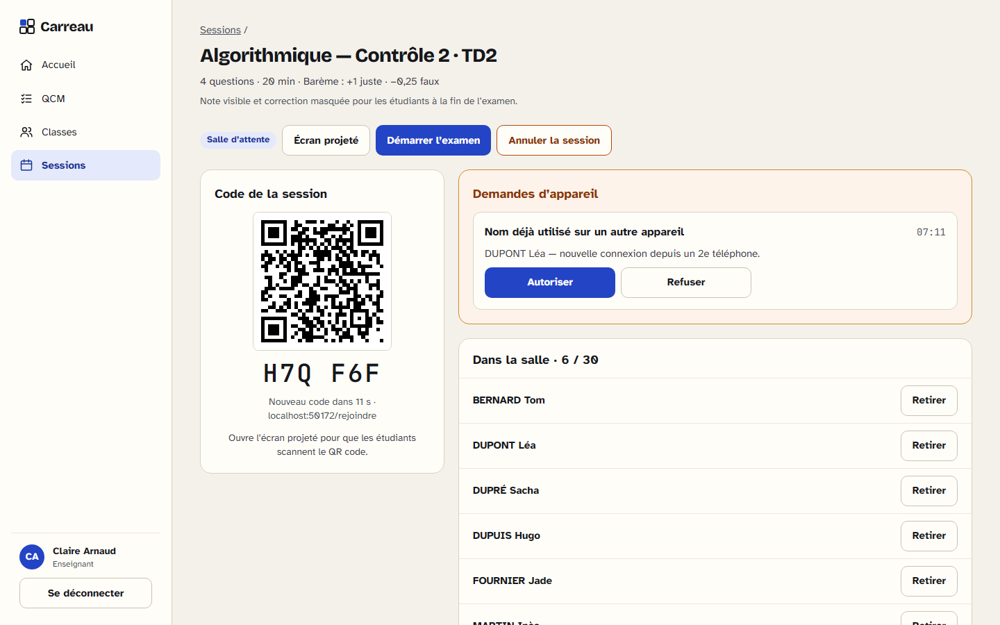
*Le pilotage de la session : un nom réclamé depuis un second téléphone attend la décision de l’enseignant.*

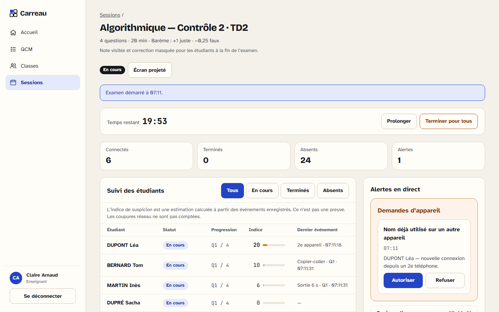
*Le suivi en direct : une sortie de 6 s et un copier-coller apparaissent aussitôt, avec l’heure et la question ; l’indice n’est jamais présenté comme une preuve.*

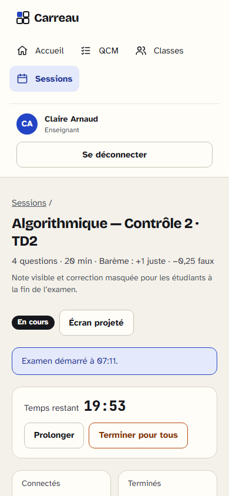

*Le même tableau de bord sur le téléphone de l’enseignant.*

## Fonctionnement

### Pour l’étudiant

1. Il scanne le QR code projeté au tableau, ou saisit le code de la session.
2. Il tape les trois premières lettres de son nom ou de son prénom et se choisit dans la liste de sa classe. Son téléphone est alors associé à son nom pour toute la durée de l’examen ; si ce nom est déjà pris sur un autre téléphone, l’enseignant autorise ou refuse le nouveau.
3. Un écran d’information lui explique ce qui est noté pendant l’examen, pourquoi, et combien de temps c’est conservé.
4. Il patiente en salle d’attente : l’examen démarre pour tout le monde en même temps.
5. Il répond question par question, sans retour en arrière : chaque touche est enregistrée, « Valider et continuer » passe à la suivante. Si le temps de la question (ou de l’examen) s’écoule, sa dernière sélection est validée. Un téléphone qui s’éteint ne bloque rien : à son retour, le temps a continué de courir. À la fin, il voit combien de questions il a répondues et sa note, si l’enseignant la rend visible.

Aucun compte ni installation n’est nécessaire. L’application peut être installée sur l’écran d’accueil (PWA) pour ceux qui le souhaitent.

### Pour l’enseignant

- **Compte sur invitation**, envoyée par email.
- **Éditeur de QCM** : choix unique, choix multiples, vrai/faux, images dans les questions et les réponses, blocs de code colorés (Python, JavaScript, Java, C, SQL…), barème par question (points négatifs compris), chrono au choix (aucun, global ou par question). Tout s’enregistre au fil de la saisie ; l’éditeur montre ce qui manque, et un QCM ne passe en « prêt » que complet. Un aperçu montre chaque question comme sur le téléphone d’un étudiant.
- **Questions liées** : deux questions qui doivent se suivre restent consécutives, dans leur ordre, où qu’elles tombent dans le mélange. Les boutons Monter et Descendre déplacent le bloc entier.
- **Classes** : import de la liste depuis un fichier CSV ou Excel (`.xlsx`), ou collée depuis un tableur, avec un aperçu qui explique chaque ligne rejetée avant d’enregistrer ; ajout, modification et retrait un par un ; tiers-temps par étudiant ; deux étudiants aux mêmes nom et prénom sont refusés dans une classe (l’enseignant les distingue par une initiale).
- **Sessions** : un QCM prêt, une classe, un créneau facultatif. Le QR code projeté change toutes les 30 secondes pour qu’un lien partagé à l’extérieur de la salle ne serve à rien. L’enseignant voit la salle se remplir, autorise ou refuse un second téléphone, et démarre l’examen pour tous au même instant. Pendant l’examen, il peut prolonger le chrono global ou terminer l’examen pour tous ; sinon la session se termine seule quand tout le monde a fini ou que le temps est écoulé.
- **Suivi en direct** : statut, progression, indice de suspicion et dernier événement de chaque étudiant, compteurs, alertes (sortie de l’application avec sa durée, copier-coller, écran partagé, connexion perdue), sur ordinateur comme sur téléphone.
- **Résultats** : exports CSV et Excel, rapport détaillé par étudiant, note et correction visibles ou non par les étudiants.
- **Rattrapage** : un étudiant arrivé après le démarrage ne peut plus rejoindre la session ; l’enseignant lui ouvre une session de rattrapage.
- **Connexion MCP** : l’enseignant peut connecter son assistant IA pour préparer des QCM. Tout arrive en brouillon, à relire avant usage.

### Pour l’administration

- Un super-administrateur et des administrateurs invitent, relancent et désactivent les comptes enseignants.
- **Invitations** : lien personnel à usage unique, valable 7 jours par défaut. « Relancer » révoque l’ancien lien et en émet un nouveau, que l’email soit parti ou non.
- **Désactivation** : ferme aussitôt les sessions ouvertes et les jetons MCP de l’enseignant ; ses données sont conservées et redeviennent accessibles à la réactivation.
- **Double authentification perdue** : un admin la réinitialise pour un enseignant depuis l’administration (nouvel enrôlement à la connexion suivante) ; le super-admin passe par `npm run admin:reinitialiser-totp -- <email>` sur le serveur.
- Le super-administrateur règle en plus les rôles, l’envoi des emails, la validité des invitations et la durée de conservation des données.

## Anti-triche : ce que Carreau détecte, et ce qu’il ne peut pas détecter

| Détecté et horodaté | Hors de portée d’un navigateur |
| --- | --- |
| Sortie de l’application ou changement d’onglet, avec sa durée | Un second appareil |
| Perte de focus (notification ouverte) et redimensionnement marqué (écran partagé, heuristique) | Une capture d’écran sur iPhone |
| Copier-coller | Une réponse soufflée par un voisin |
| Temps passé sur chaque question | |
| Un même nom utilisé sur deux appareils | |
| Silence du téléphone de plus de 15 s, mesuré par le serveur | |

Principes retenus :

- **Un sujet différent pour chacun** : l’ordre des questions et celui des réponses sont mélangés pour chaque étudiant.
- **Le serveur fait foi** : le chrono, l’ordre des questions, les bonnes réponses et le score ne dépendent jamais du téléphone. Les bonnes réponses ne quittent pas le serveur pendant l’examen.
- **Un indice, pas un verdict** : les événements bruts sont enregistrés côté serveur, puis pondérés en un indice de 0 à 100 (pondération v1 publique, dans `src/lib/regles-surveillance.ts`). Le téléphone ne dit que la nature de ce qu’il observe : les durées sont mesurées par le serveur. Le détail du calcul est enregistré avec l’indice. Ce n’est pas une preuve.
- **Pas de faux positifs réseau** : une coupure de connexion n’est jamais comptée comme une sortie.
- **Un ton non accusateur** : côté étudiant, l’interface parle de « mode examen » et explique ce qui est noté, sans soupçonner personne.

## Données personnelles

- **Minimisation** : nom, prénom, réponses et événements horodatés. Rien d’autre.
- **Information** : chaque étudiant lit, avant l’examen, ce qui est enregistré et à quoi cela sert.
- **Conservation** : durées réglables par l’établissement, suppression automatique à l’échéance.
- **Assistant IA** : via MCP, il ne voit que les brouillons de QCM et le nom des classes, jamais les étudiants ni les résultats.

## Architecture

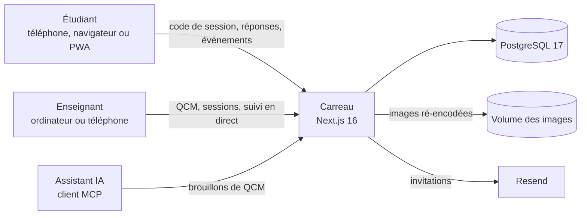

| Domaine | Choix |
| --- | --- |
| Application | Next.js 16 (App Router), React 19, TypeScript |
| Interface | Tailwind CSS 4, PWA |
| Données | PostgreSQL 17, Drizzle ORM |
| Validation | Zod 4, systématique côté serveur |
| Import de listes | `papaparse` (CSV et collage), `read-excel-file` (Excel), archives contrôlées par `fflate` |
| Images et code | `sharp` (ré-encodage WebP, métadonnées retirées), `shiki` (coloration du code côté serveur, en texte) |
| Emails | Resend |
| Assistant IA | Serveur MCP (`mcp-handler`) |
| Tests | Vitest (unitaires et intégration), Playwright (parcours complets, dont téléphone) |
| Intégration continue | GitHub Actions : lint, format, types, tests unitaires et d’intégration, build, tests de bout en bout |
| Déploiement | Image Docker autonome (build `standalone`), Coolify |

### Organisation du code

```
src/
  app/          pages et routes d’API (App Router)
  modules/      un dossier par domaine métier, exposé par son index.ts ; les droits sont vérifiés dans les services
  moteur/       logique pure, sans accès à la base : code de session tournant (lot 4), mélange, échéances et notation (lot 5), consolidation des événements et indice (lot 6)
  lib/          contrats partagés : erreurs, enveloppes, environnement, horloge, chiffrement, CSP
  db/           schéma Drizzle
  components/   composants d’interface partagés
drizzle/        migrations SQL versionnées
e2e/            tests de bout en bout (Playwright)
```

Ces frontières sont vérifiées par ESLint : une page n’atteint un domaine que par son point d’entrée public, un domaine n’importe jamais une page, et le moteur reste testable sans base de données.

Les choix techniques et leurs raisons sont consignés dans [`docs/choix.csv`](docs/choix.csv), l’architecture dans [`docs/memory.md`](docs/memory.md), la conception détaillée dans [`docs/specs/`](docs/specs/) et l’historique dans [`docs/changelog.md`](docs/changelog.md).

## Démarrer en local

Prérequis : Node.js 24 et Docker.

```bash
npm install
cp .env.example .env    # puis renseigner CHIFFREMENT_CLE et NEXT_SERVER_ACTIONS_ENCRYPTION_KEY
npm run db:up           # PostgreSQL de développement (50170) et de test (50171)
npm run db:migrate
npm run admin:creer -- ton.adresse@exemple.fr   # lien d'activation du premier compte (super-admin)
npm run dev             # http://localhost:50173
```

Ouvre le lien, choisis ton mot de passe et configure la double authentification ; renseigne ensuite Resend et la conservation des données dans Paramètres, puis invite tes collègues.

| Commande | Rôle |
| --- | --- |
| `npm run lint`, `npm run format:check`, `npm run typecheck` | Qualité du code, frontières d’architecture, mise en forme et types |
| `npm test` | Tests unitaires et couverture |
| `npm run test:integration` | Tests d’intégration, chaque fichier sur sa propre base PostgreSQL clonée |
| `npm run build && npm run test:e2e` | Tests de bout en bout sur le build de production (ordinateur, iPhone, Android) |
| `npm run build && npm run captures` | Captures du README, sur le build de production, avec des données fictives |
| `npm run admin:creer -- <email>` | Invitation du premier super-admin, lien affiché une fois |
| `npm run admin:reinitialiser-totp -- <email>` | Double authentification perdue : nouvel enrôlement à la prochaine connexion |

L’image Docker de production applique les migrations au démarrage, puis lance le serveur ; son état est exposé sur `/api/sante`. La procédure de mise en ligne sera documentée avec le dernier lot.

## Feuille de route

Chaque lot est livré avec ses tests, sa documentation et une intégration continue verte.

| Lot | Contenu | État |
| --- | --- | --- |
| 0 | Socle technique : Next.js 16 autonome, PostgreSQL et migrations, CSP à nonce, limiteur de débit, journal d’audit, tests et intégration continue | ✅ Livré |
| 1 | Comptes : super-administrateur, invitations par email, double authentification (TOTP) obligatoire, rôles, paramètres d’envoi et de conservation | ✅ Livré |
| 2 | Classes et étudiants : import CSV / Excel ou collage, tiers-temps | ✅ Livré |
| 3 | Éditeur de QCM : types de questions, images, code, barème, questions liées, chrono | ✅ Livré |
| 4 | Sessions : QR code renouvelé, écran projeté, salle d’attente, démarrage commun, demandes d’appareil | ✅ Livré |
| 5 | Passage de l’examen : mélange, chrono serveur, reprise après coupure, tiers-temps, notation | ✅ Livré |
| 6 | Surveillance et suivi en direct : détection des écarts, indice de suspicion, tableau de bord | ✅ Livré |
| 7 | Résultats : exports CSV et Excel, rapport par étudiant, rattrapage | À venir |
| 8 | Connexion MCP : jetons par enseignant, création de brouillons | À venir |
| 9 | PWA et identité visuelle : installation, scanner intégré, icônes | À venir |
| 10 | Mise en production : Coolify, purges automatiques, sauvegardes | À venir |

## Sécurité

Carreau sert à évaluer : une faille peut fausser des notes ou exposer des données d’étudiants. Le code part donc du principe que certains utilisateurs chercheront à contourner les règles.

- **En-têtes stricts** : Content Security Policy à nonce générée à chaque requête, interdiction d’affichage dans un cadre, HSTS en production.
- **Entrées contrôlées** : chaque entrée est validée côté serveur (Zod), les corps JSON sont bornés en taille, les requêtes SQL sont toujours paramétrées.
- **Limitation de débit** : compteurs stockés en base, par compte, par adresse IP ou par participation.
- **Secrets chiffrés** : les secrets conservés en base, comme la clé d’envoi des emails, sont chiffrés en AES-256-GCM.
- **Erreurs sans fuite** : aucune pile d’appels ni requête SQL n’est renvoyée, et les journaux ne contiennent pas de données personnelles.
- **Droits vérifiés côté serveur** : dans chaque service, jamais seulement dans l’interface ; la ressource d’un autre enseignant répond « introuvable ».
- **Entrée des étudiants** : code de session tiré d’un HMAC et renouvelé toutes les 30 secondes (32⁶ combinaisons, projeté seulement en salle d’attente), ticket d’entrée signé valable 10 minutes, jeton d’appareil de 256 bits dont seule l’empreinte est stockée, cookies `HttpOnly` et `SameSite=Lax`, limitation par adresse IP, par ticket et par appareil ; un nom déjà pris sur un autre téléphone passe par l’enseignant.
- **Passage de l’examen** : le téléphone ne reçoit que la question courante, sans l’indicateur de bonne réponse ; ses réponses y sont identifiées par leur position affichée, jamais par leur place dans le QCM. Ordre, chrono (tolérance réseau de 3 s), points et note sont calculés par le serveur, dans une transaction verrouillée ; une validation rejouée ne change rien ; un QCM modifié après le départ ne change pas l’examen en cours (instantané figé au démarrage).
- **Surveillance** : le téléphone n’envoie que la nature d’un événement et un numéro d’ordre, jamais d’heure ni de durée ; lots bornés (50 événements, 4 Ko), dédoublonnés, 1 000 événements au plus par passage, 120 lots par minute ; un silence de plus de 15 s est constaté par le serveur, même si le téléphone se tait.
- **Imports bornés** : le type d’un fichier se décide sur ses octets et non sur son extension ; taille (512 Ko) et nombre de lignes (500) limités ; un classeur Excel est contrôlé avant sa décompression, qui s’arrête au-delà de 10 Mo (bombe de décompression).
- **Images assainies** : le format se décide sur les octets (PNG, JPEG, WebP, GIF non animé), taille (5 Mo) et nombre de pixels bornés, ré-encodage en WebP qui retire les métadonnées (position GPS comprise), lecture réservée au propriétaire et, pendant l’examen, à l’étudiant dont c’est la question courante, jamais de SVG.
- **Aucun HTML injecté** : énoncés, réponses et code sont affichés comme du texte ; la coloration du code est calculée côté serveur en jetons, jamais en HTML.
- **Comptes protégés** : mots de passe argon2id, double authentification TOTP obligatoire, sessions de 12 h (30 min d’inactivité) révoquées à la désactivation et à la réinitialisation du mot de passe, limitation des tentatives.

Merci de signaler toute vulnérabilité de façon privée, comme décrit dans [`SECURITY.md`](SECURITY.md).

## Contribuer

Les suggestions et retours sont les bienvenus via les issues. Les commits suivent la convention [Conventional Commits](https://www.conventionalcommits.org/fr/), rédigés en français.

## Licence

Distribué sous licence [MIT](LICENSE) — © 2026 Yves Charvis.

Vous pouvez utiliser, modifier et redistribuer Carreau librement, à condition de conserver la mention de l’auteur et le texte de la licence.
