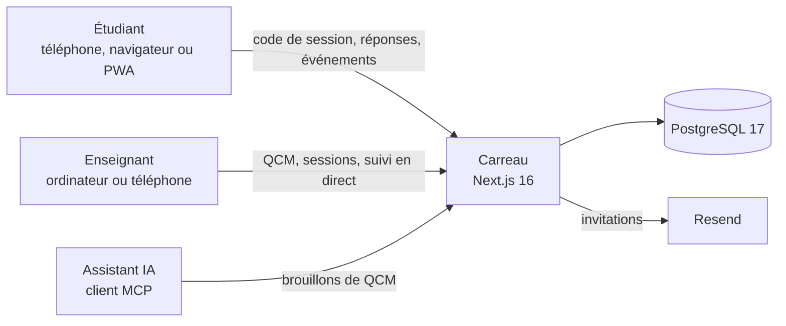

<div align="center">

# Carreau

**Des QCM sur téléphone, en classe, pour des examens équitables.**

Les étudiants rejoignent l’examen en scannant un QR code et répondent question par question sur leur téléphone. L’enseignant suit la session en direct.

[Fonctionnement](#fonctionnement) · [Anti-triche](#anti-triche--ce-que-carreau-détecte-et-ce-quil-ne-peut-pas-détecter) · [Données personnelles](#données-personnelles) · [Architecture](#architecture) · [Feuille de route](#feuille-de-route) · [Licence](#licence)


[](https://github.com/a8naaijetvi2lunk/carreau/actions/workflows/ci.yml)


</div>

> [!NOTE]
> Carreau est en cours de développement. Le socle technique est en place ; les fonctionnalités arrivent lot par lot (voir la [feuille de route](#feuille-de-route)). Les captures d’écran arriveront avec la première version fonctionnelle.

## Pourquoi Carreau

Faire passer un QCM sur le téléphone des étudiants est pratique : pas de papier, correction immédiate, résultats exportables. Mais sur un téléphone, une autre application ou un autre onglet n’est jamais loin.

Un navigateur ne peut pas verrouiller un téléphone. Carreau ne prétend donc pas empêcher toute triche. Il rend les écarts **visibles**, de façon **transparente** pour les étudiants, et laisse l’enseignant juger avec ce qu’il observe en salle.

Le nom tient en un mot : les petits carrés du QR code, les cases qu’on coche, et l’expression « se tenir à carreau ».

## Fonctionnement

### Pour l’étudiant

1. Il scanne le QR code projeté au tableau, ou saisit le code de la session.
2. Il tape les trois premières lettres de son nom et se choisit dans la liste de sa classe. Son téléphone est alors associé à son nom pour toute la durée de l’examen.
3. Un écran d’information lui explique ce qui est noté pendant l’examen, pourquoi, et combien de temps c’est conservé.
4. Il patiente en salle d’attente : l’examen démarre pour tout le monde en même temps.
5. Il répond question par question, sans retour en arrière, avec un chrono si l’enseignant en a prévu un.

Aucun compte ni installation n’est nécessaire. L’application peut être installée sur l’écran d’accueil (PWA) pour ceux qui le souhaitent.

### Pour l’enseignant

- **Compte sur invitation**, envoyée par email.
- **Éditeur de QCM** : choix unique, choix multiples, vrai/faux, images dans les questions et les réponses, blocs de code, barème configurable (points négatifs compris), chrono au choix (aucun, global ou par question).
- **Questions liées** : deux questions qui doivent se suivre restent consécutives, dans leur ordre, où qu’elles tombent dans le mélange.
- **Classes** : import de la liste depuis un fichier CSV ou Excel, ou saisie manuelle ; tiers-temps par étudiant.
- **Sessions** : un QCM, une classe, un créneau. Le QR code projeté change toutes les 30 secondes pour qu’un lien partagé à l’extérieur de la salle ne serve à rien.
- **Suivi en direct** : étudiants connectés et absents, progression, alertes et indice de suspicion, sur ordinateur comme sur téléphone.
- **Résultats** : exports CSV et Excel, rapport détaillé par étudiant, note et correction visibles ou non par les étudiants.
- **Rattrapage** : un étudiant arrivé après le démarrage ne peut plus rejoindre la session ; l’enseignant lui ouvre une session de rattrapage.
- **Connexion MCP** : l’enseignant peut connecter son assistant IA pour préparer des QCM. Tout arrive en brouillon, à relire avant usage.

### Pour l’administration

- Un super-administrateur et des administrateurs invitent, relancent et désactivent les comptes enseignants.
- Le super-administrateur règle l’envoi des emails, la validité des invitations et la durée de conservation des données.

## Anti-triche : ce que Carreau détecte, et ce qu’il ne peut pas détecter

| Détecté et horodaté | Hors de portée d’un navigateur |
| --- | --- |
| Sortie de l’application ou changement d’onglet, avec sa durée | Un second appareil |
| Perte de focus : notification ouverte, écran partagé | Une capture d’écran sur iPhone |
| Copier-coller | Une réponse soufflée par un voisin |
| Temps passé sur chaque question | |
| Un même nom utilisé sur deux appareils | |

Principes retenus :

- **Un sujet différent pour chacun** : l’ordre des questions et celui des réponses sont mélangés pour chaque étudiant.
- **Le serveur fait foi** : le chrono, l’ordre des questions, les bonnes réponses et le score ne dépendent jamais du téléphone. Les bonnes réponses ne quittent pas le serveur pendant l’examen.
- **Un indice, pas un verdict** : les événements bruts sont enregistrés côté serveur, puis pondérés en un indice de 0 à 100. L’enseignant voit le détail du calcul. Ce n’est pas une preuve.
- **Pas de faux positifs réseau** : une coupure de connexion n’est jamais comptée comme une sortie.
- **Un ton non accusateur** : côté étudiant, l’interface parle de « mode examen » et explique ce qui est noté, sans soupçonner personne.

## Données personnelles

- **Minimisation** : nom, prénom, réponses et événements horodatés. Rien d’autre.
- **Information** : chaque étudiant lit, avant l’examen, ce qui est enregistré et à quoi cela sert.
- **Conservation** : durées réglables par l’établissement, suppression automatique à l’échéance.
- **Assistant IA** : via MCP, il ne voit que les brouillons de QCM et le nom des classes, jamais les étudiants ni les résultats.

## Architecture



| Domaine | Choix |
| --- | --- |
| Application | Next.js 16 (App Router), React 19, TypeScript |
| Interface | Tailwind CSS 4, PWA |
| Données | PostgreSQL 17, Drizzle ORM |
| Validation | Zod 4, systématique côté serveur |
| Emails | Resend |
| Assistant IA | Serveur MCP (`mcp-handler`) |
| Tests | Vitest (unitaires et intégration), Playwright (parcours complets, dont téléphone) |
| Intégration continue | GitHub Actions : lint, format, types, tests unitaires et d’intégration, build, tests de bout en bout |
| Déploiement | Image Docker autonome (build `standalone`), Coolify |

### Organisation du code

```
src/
  app/          pages et routes d’API (App Router)
  modules/      un dossier par domaine métier, exposé par son index.ts ; les droits sont vérifiés dans les services
  moteur/       logique pure, sans accès à la base : mélange, notation, échéances, indice (à partir du lot 4)
  lib/          contrats partagés : erreurs, enveloppes, environnement, horloge, chiffrement, CSP
  db/           schéma Drizzle
  components/   composants d’interface partagés
drizzle/        migrations SQL versionnées
e2e/            tests de bout en bout (Playwright)
```

Ces frontières sont vérifiées par ESLint : une page n’atteint un domaine que par son point d’entrée public, un domaine n’importe jamais une page, et le moteur reste testable sans base de données.

Les choix techniques et leurs raisons sont consignés dans [`docs/choix.csv`](docs/choix.csv), l’architecture dans [`docs/memory.md`](docs/memory.md), la conception détaillée dans [`docs/specs/`](docs/specs/) et l’historique dans [`docs/changelog.md`](docs/changelog.md).

## Démarrer en local

Prérequis : Node.js 24 et Docker.

```bash
npm install
cp .env.example .env    # puis renseigner CHIFFREMENT_CLE et NEXT_SERVER_ACTIONS_ENCRYPTION_KEY
npm run db:up           # PostgreSQL de développement (50170) et de test (50171)
npm run db:migrate
npm run dev             # http://localhost:50173
```

| Commande | Rôle |
| --- | --- |
| `npm run lint`, `npm run format:check`, `npm run typecheck` | Qualité du code, frontières d’architecture, mise en forme et types |
| `npm test` | Tests unitaires et couverture |
| `npm run test:integration` | Tests d’intégration, chaque fichier sur sa propre base PostgreSQL clonée |
| `npm run build && npm run test:e2e` | Tests de bout en bout sur le build de production (ordinateur, iPhone, Android) |

L’image Docker de production applique les migrations au démarrage, puis lance le serveur ; son état est exposé sur `/api/sante`. La procédure de mise en ligne sera documentée avec le dernier lot.

## Feuille de route

Chaque lot est livré avec ses tests, sa documentation et une intégration continue verte.

| Lot | Contenu | État |
| --- | --- | --- |
| 0 | Socle technique : Next.js 16 autonome, PostgreSQL et migrations, CSP à nonce, limiteur de débit, journal d’audit, tests et intégration continue | ✅ Livré |
| 1 | Comptes : super-administrateur, invitations par email, double authentification (TOTP) obligatoire, rôles, paramètres d’envoi et de conservation | À venir |
| 2 | Classes et étudiants : import CSV / Excel ou collage, tiers-temps | À venir |
| 3 | Éditeur de QCM : types de questions, images, code, barème, questions liées, chrono | À venir |
| 4 | Sessions : QR code renouvelé, écran projeté, salle d’attente, démarrage commun | À venir |
| 5 | Passage de l’examen : mélange, chrono serveur, reprise après coupure, tiers-temps, notation | À venir |
| 6 | Surveillance et suivi en direct : détection des écarts, indice de suspicion, tableau de bord | À venir |
| 7 | Résultats : exports CSV et Excel, rapport par étudiant, rattrapage | À venir |
| 8 | Connexion MCP : jetons par enseignant, création de brouillons | À venir |
| 9 | PWA et identité visuelle : installation, scanner intégré, icônes | À venir |
| 10 | Mise en production : Coolify, purges automatiques, sauvegardes | À venir |

## Sécurité

Carreau sert à évaluer : une faille peut fausser des notes ou exposer des données d’étudiants. Le code part donc du principe que certains utilisateurs chercheront à contourner les règles.

- **En-têtes stricts** : Content Security Policy à nonce générée à chaque requête, interdiction d’affichage dans un cadre, HSTS en production.
- **Entrées contrôlées** : chaque entrée est validée côté serveur (Zod), les corps JSON sont bornés en taille, les requêtes SQL sont toujours paramétrées.
- **Limitation de débit** : compteurs stockés en base, par compte, par adresse IP ou par participation.
- **Secrets chiffrés** : les secrets conservés en base, comme la clé d’envoi des emails, sont chiffrés en AES-256-GCM.
- **Erreurs sans fuite** : aucune pile d’appels ni requête SQL n’est renvoyée, et les journaux ne contiennent pas de données personnelles.
- **Droits vérifiés côté serveur** : dans chaque service, jamais seulement dans l’interface ; la ressource d’un autre enseignant répond « introuvable ».

Merci de signaler toute vulnérabilité de façon privée, comme décrit dans [`SECURITY.md`](SECURITY.md).

## Contribuer

Les suggestions et retours sont les bienvenus via les issues. Les commits suivent la convention [Conventional Commits](https://www.conventionalcommits.org/fr/), rédigés en français.

## Licence

Distribué sous licence [MIT](LICENSE) — © 2026 Yves Charvis.

Vous pouvez utiliser, modifier et redistribuer Carreau librement, à condition de conserver la mention de l’auteur et le texte de la licence.
